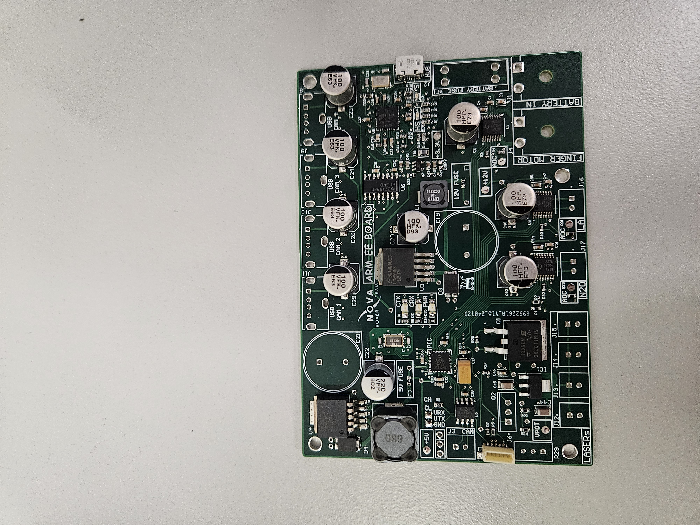
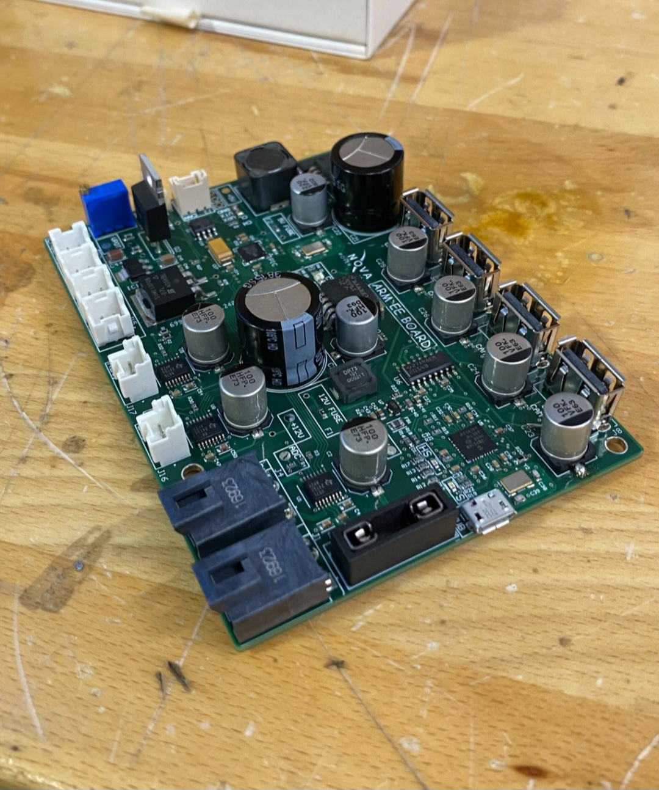
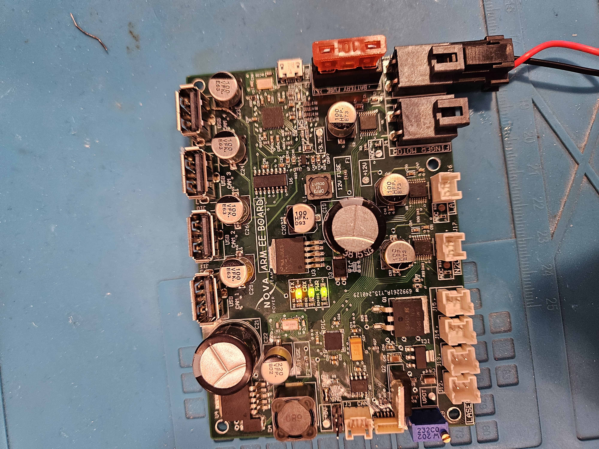

# End-Effector-PCB
A custom PCB to control the End Effector of the rover arm for Monash Nova Rover. 

The PCB contains an integrated 4-port USB hub IC, 3 motor drivers and a laser diode controller circuit powered by a linear voltage regulator IC. 

Additional circuitry includes buck converters and LDOs to gain access to 12V, 5V and 3.3V rails. 

Instructions are sent via the CAN protocol to the board.

# Images
Initial development

Final product

# Demo
https://github.com/Joseph-T-Nguyen/End-Effector-PCB/assets/129492079/8da5807f-2e12-4f5f-809e-6b58b53f5fc9

